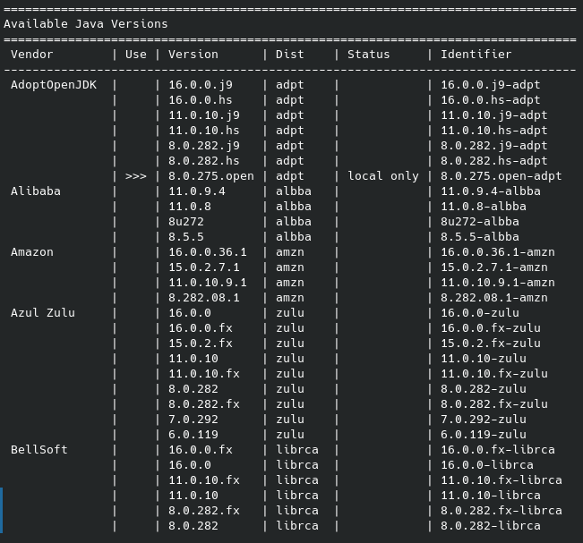

#Api Rest Example

##Project Structure
```
├── pom.xml
├── src
    ├── main
    ├── java
        └── com
            └── webee
                └── challange
                    ├── api
                        ├── DeviceController.java
                        └── ErrorResponse.java
                    ├── ChallangeApplication.java
                    ├── repository
                        ├── DeviceRepository.java
                        └── models
                            └── Device.java
                    └── services
                        ├── DeviceServices.java
                        └── ErrorService.java
    └── resources
        └── application.properties
    └── test
        └── java
            └── com
                └── webee
                    └── challange
                    ├── api
                        └── TestDeviceControllerMock.java
                    └── ChallangeApplicationTests.java
```
##Requirements

###JAVA 8

In this example java is installed through sdkman
```
curl -s "https://get.sdkman.io" | bash
```
```
source "$HOME/.sdkman/bin/sdkman-init.sh"
```
```
sdk version
```

SDKMAN USAGE
```
sdk list java
```



```
sdk install java 8.0.275.open-adpt
```

###Make Install
```
apt install make
```

###Clone Repo
```
git clone https://github.com/ggiuliodori/apiRestExample.git
```
```
cd apiRestExample
```
##Run Java App with database running in Google Datastore
set aplication.properties file with database credentials
> :warning: **spring.jpa.hibernate.ddl-auto=create** when this property is active, the database is regenerated
every time the app is initialized. to disable this option, comment out the line in application.properties

Build
```
make build
```

Run test
```
make test-run
```

Run develop
```
make develop-run
```

##Run Java App locally

###Requirment
Docker and docker-compose installed

Build
```
make build
```

Run test
```
make test-run
```

Run local-develop
```
make local-develop-run
```

###END POINTS
https://app.swaggerhub.com/apis/ggiuliodori/apiRestExample/1.0.0

##TO DO
deployment app in GEA